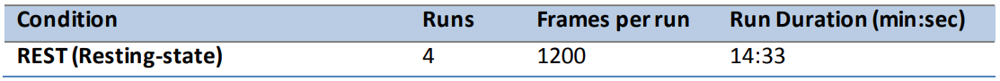
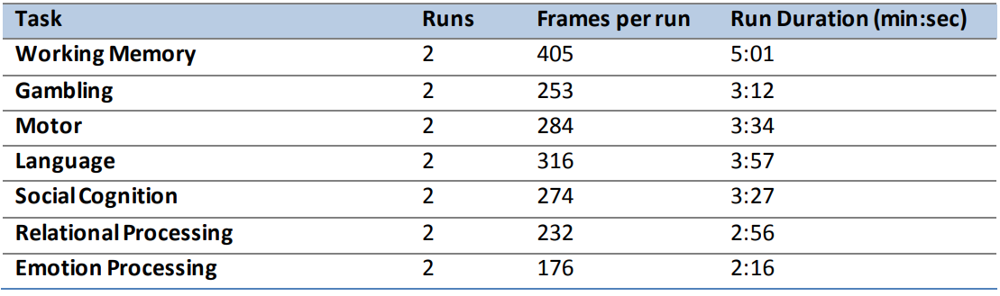

I wanted to talk about how we pre-process data in the lab, and some other approaches

**Contents**
* TOC
{:toc}

## HCP Approach
The information here is taken from the reference manual for the last release of HCP data titled HCP_S1200 ([here](https://www.humanconnectome.org/storage/app/media/documentation/s1200/HCP_S1200_Release_Reference_Manual.pdf))

Some notable points are that that the resting state totals 57 minutes!

The other tasks that are included are below:

To understand the preproccessing pipeline, we have to go to the WashU github page ([here](https://github.com/Washington-University/HCPpipelines)). 
